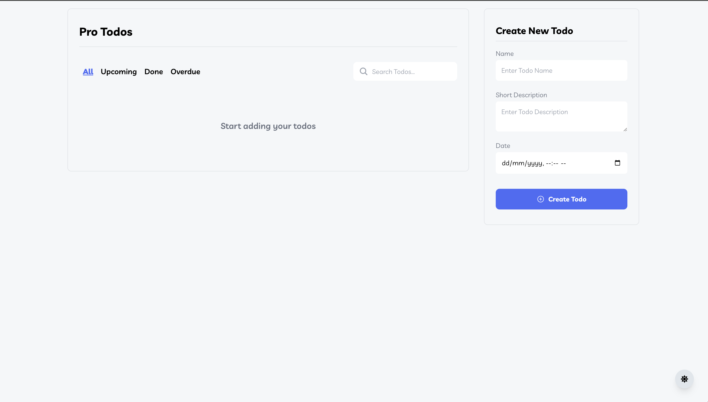
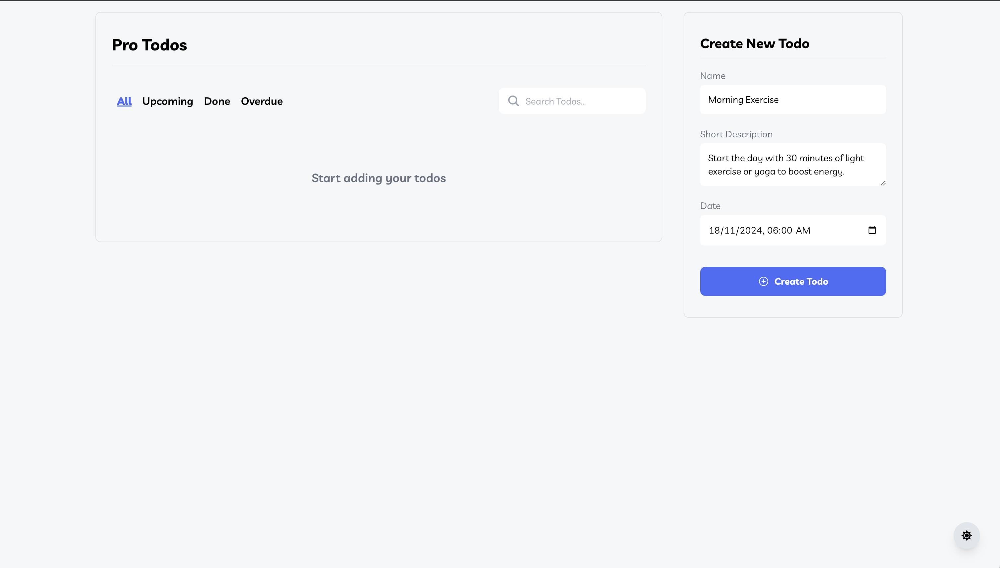
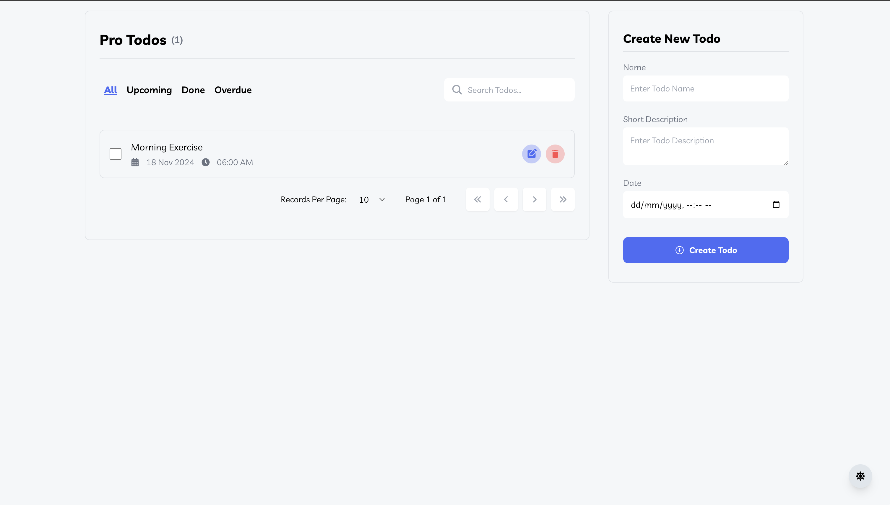
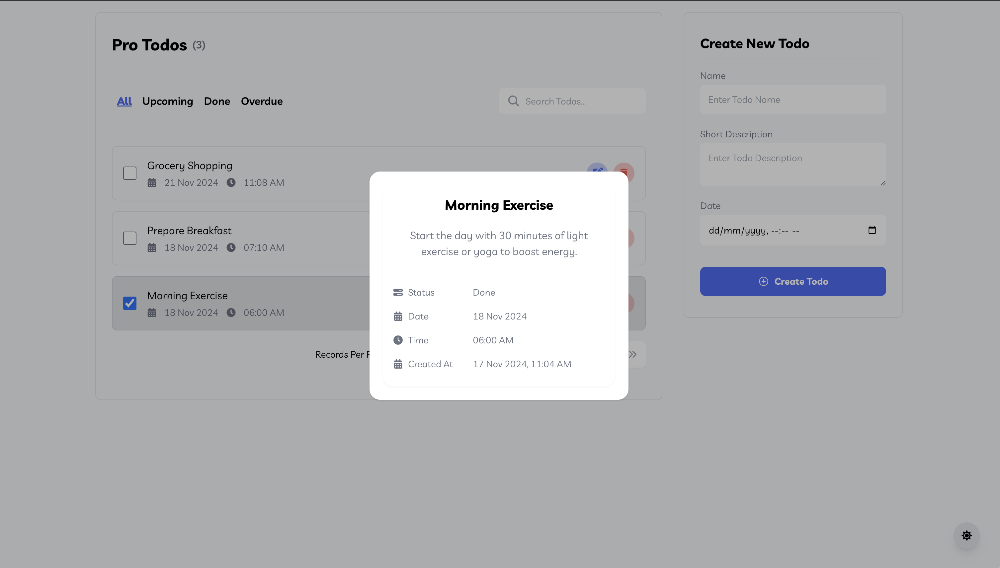
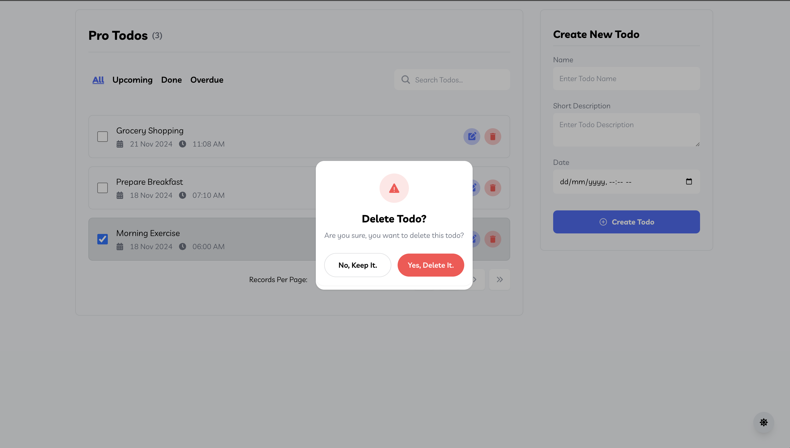
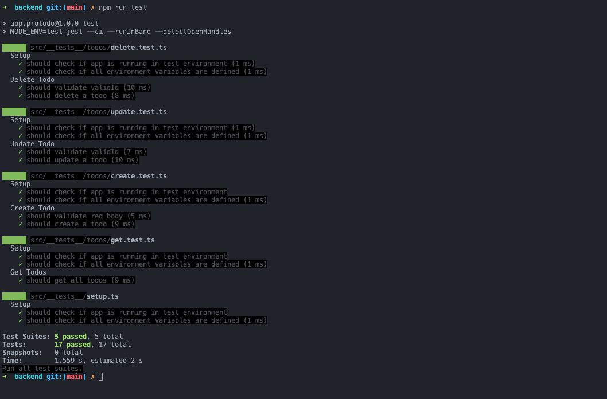
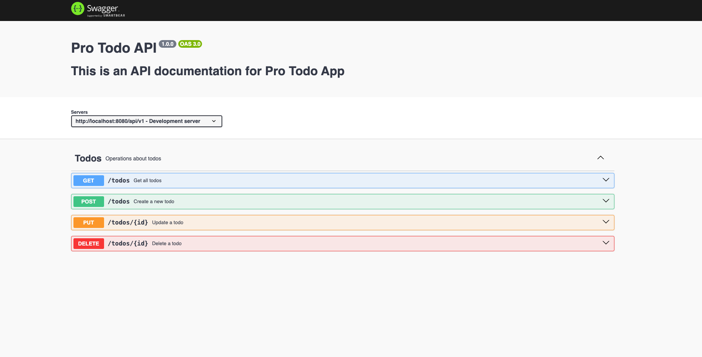
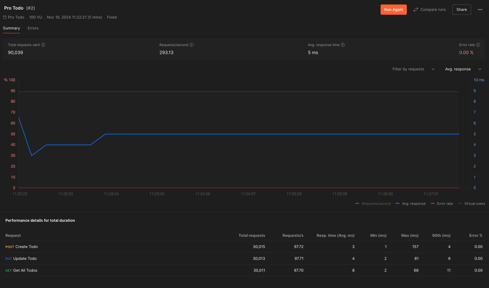

# Technical Documentation for ToDo Application

---

## Table of Contents

1. [Overview](#overview)
2. [Technologies Used](#technologies-used)
3. [System Architecture](#system-architecture)
4. [Backend](#backend)
   - [Folder Structure](#folder-structure)
   - [Key Features](#key-features)
   - [Setup and Configuration](#setup-and-configuration)
   - [Routes](#routes)
5. [Frontend](#frontend)
   - [Folder Structure](#frontend-folder-structure)
   - [Key Features](#frontend-key-features)
   - [Setup and Configuration](#frontend-setup-and-configuration)
6. [Validation and Error Handling](#validation-and-error-handling)
7. [Testing](#testing)
8. [Deployment](#deployment)

---

## Overview

The **ToDo Application** is a full-stack application built to manage tasks efficiently. It allows users to create, update, delete, and filter tasks based on their status (`All`, `Done`, `Upcoming`, `Overdue`). The backend is implemented in **Node.js** with **Express** and **TypeScript**, using **MySQL** for data persistence. The frontend uses **Next.js** and **Axios** to provide a responsive and interactive user experience.

---

## Technologies Used

### Backend:

- **Node.js**
- **Express**
- **TypeScript**
- **Sequelize-Typescript**
- **MySQL**
- **ESLint, Prettier**
- **Jest** for unit testing

### Frontend:

- **Next.js**
- **Axios**
- **Tailwind CSS** for styling
- **TypeScript**

---

## System Architecture

The application follows a **Model-View-Controller (MVC)** architecture for backend design and leverages. The frontend is built using **Next.js** and **Axios** for making API requests to the backend. The backend uses **Express** and **Sequelize** for handling requests and interacting with the database.

---

## Backend

### Folder Structure

```plaintext
src/
    __tests__/            # Unit tests for application modules
    server.ts             # Entry point for the application
    app.ts                # Express application setup
    config/               # Configuration files (DB, environment variables)
    controllers/          # Route handlers for different endpoints
    errors/               # Custom error classes
    logger/               # Winston-based logging setup
    middlewares/          # Request middlewares (validation, authentication, central error handler)
    models/               # Sequelize ORM models and schema definitions
    routes/               # Route definitions
    utils/                # Utility functions
```

### Key Features

- **CRUD Operations**: Create, Read, Update, and Delete tasks
- **Filtering**: Filter tasks based on status (`All`, `Done`, `Upcoming`, `Overdue`)
- **Validation**: Input validation using **Joi** and **Express-validator**
- **Error Handling**: Centralized error handling using custom error classes
- **Logging**: Logging using **Winston** for debugging and monitoring
- **Testing**: Unit tests using **Jest** and **Supertest**

### Setup and Configuration

1. Clone the repository:

   ```bash
   git clone https://github.com/Iamkrishnaa/pro_todo.git
   ```

2. Install dependencies:

   ```bash
   cd pro_todo/backend
   npm install
   ```

3. Create a `.env` file in the root directory and add the following environment variables:

   ```bash
   cp .env.example .env
   ```

   Change the values of the environment variables as per your configuration. **Note**: You need to create a MySQL database and provide the connection details in the `.env` file.

4. Run the application:

   ```bash
    npm run dev
   ```

5. The server should be running on `http://localhost:8080`. And base URL for API requests is `http://localhost:8080/api/v1`.

### Routes

- **GET /api/v1/tasks**: Get all tasks
- **POST /api/v1/tasks**: Create a new task
- **PUT /api/v1/tasks/:id**: Update a task by ID
- **DELETE /api/v1/tasks/:id**: Delete a task by ID

### API Documentation

## The API documentation can be found at

```bash
http://localhost:8080/api-docs
```

---

## Frontend

### Frontend Folder Structure

```plaintext
frontend/
    src/
        app/              # Main application component
        components/       # Reusable components
        enums/            # Enums
        hooks/            # Custom hooks
        errors/           # Custom error classes
        providers/        # Providers like theme provider
        services/         # API services
        styles/           # Global styles
        types/            # Custom types
        utils/            # Utility functions
```

### Key Features

- **Responsive Design**: Mobile-first design using **Tailwind CSS**
- **API Requests**: Fetch data from the backend using **Axios**
- **Context API**: Manage global state using **React Context**
- **Custom Hooks**: Implement custom hooks for managing state and side effects
- **Error Handling**: Display error messages for failed API requests
- **Routing**: Client-side routing using **Next.js** router

### Setup and Configuration

1. Install dependencies:

   ```bash
   cd pro_todo/frontend
   npm install
   ```

2. Run the application:

   ```bash
    npm run dev
   ```

3. The application should be running on `http://localhost:3000`.

---

## Validation and Error Handling

- **Validation**: Input validation is done using **Express-validator** on the backend and Custom hooks on the frontend.
- **Error Handling**: Centralized error handling is implemented using custom error classes on the backend and displaying error messages on the frontend.

---

## Testing

- **Unit Tests**: Unit tests are written using **Jest** and **Supertest** for the backend.
- **Test Coverage**: Test coverage is generated using **Jest**

To run tests:

```bash
cd backend
npm run test
```

```
NOTE: Need to create a test database and provide the connection details in the `.env` file.
```

---

## Deployment

The application can be deployed to platforms like **Heroku**, **Vercel**, **AWS** or any **VPS**. You can follow the deployment guides provided by these platforms to deploy the application.

### Example: Deploying to VPS using pm2

1. Install **pm2** globally:

   ```bash
   npm install pm2 -g
   ```

2. Start the application using **pm2**:

   ```bash
    pm2 start npm --name "todo-app" -- start
   ```

3. The application should be running in the background and can be accessed using the server's IP address or domain name.

---

## Conclusion

This documentation provides an overview of the **ToDo Application** and the technologies used to build it. You can explore the source code to understand the implementation details and make modifications as needed.

## Screenshots

### Home Page









